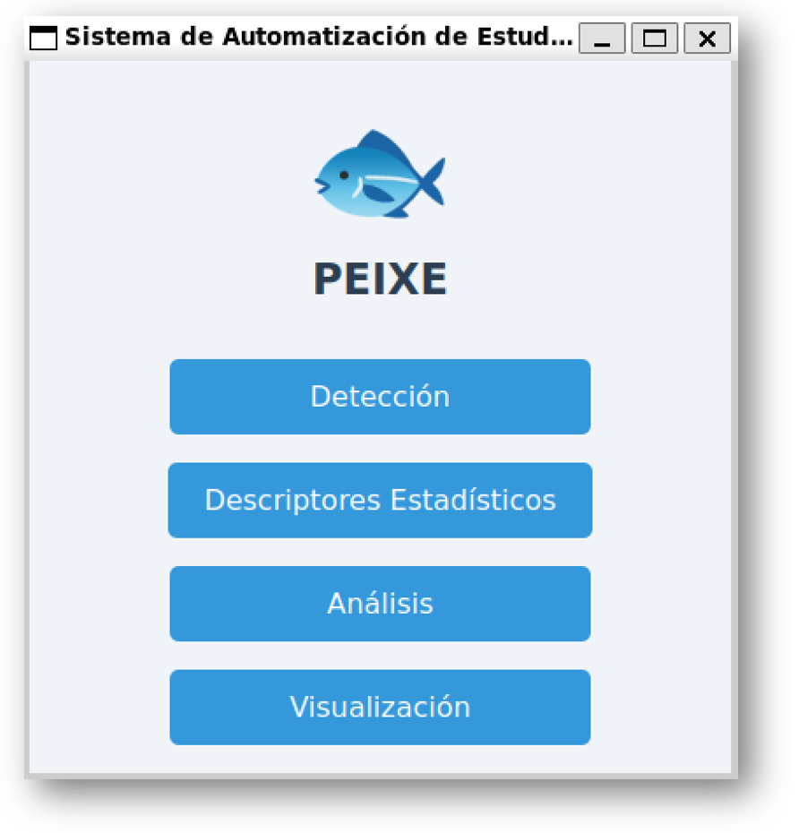
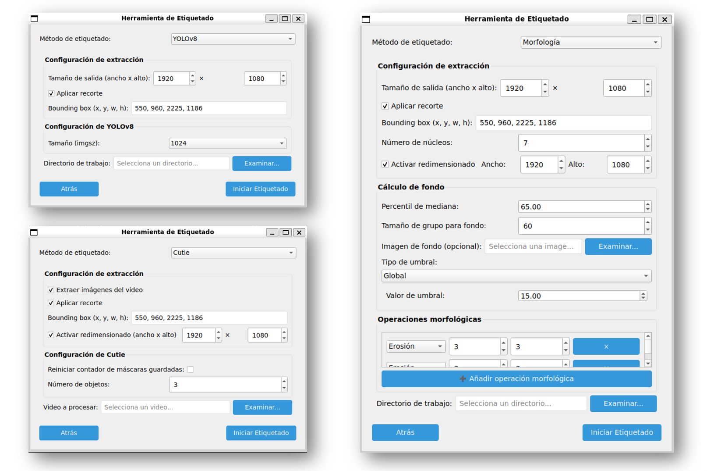
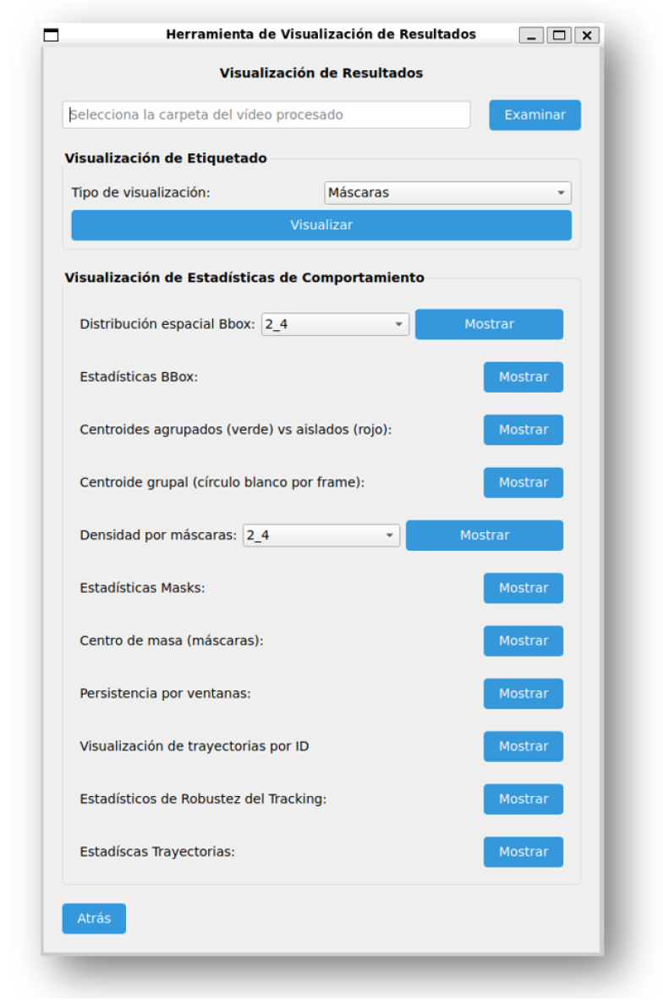
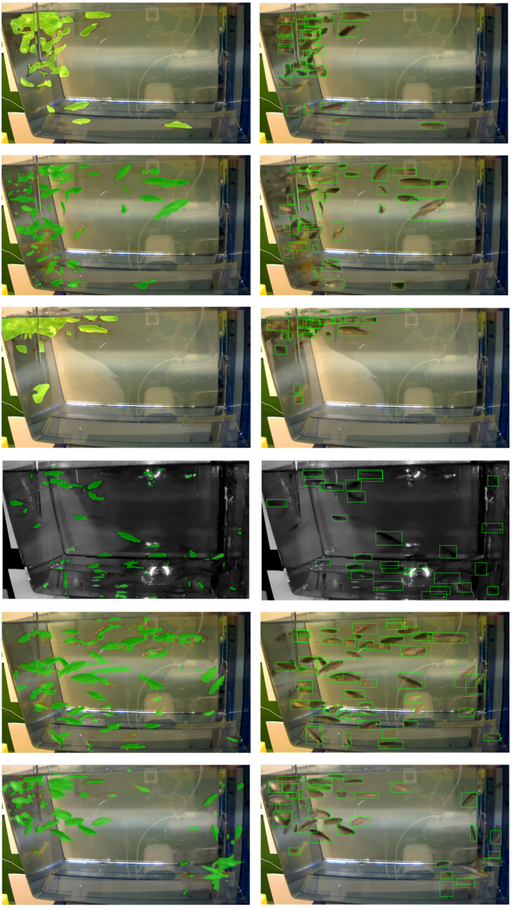

# Sistema de Análisis Automatizado del Comportamiento en Peces Cebra

## 📋 Descripción General

Este repositorio contiene la implementación completa de la interfaz gráfica desarrollada en el contexto del Trabajo Fin de Grado titulado _“Implementación de un sistema de análisis automatizado de comportamiento en peces cebra mediante visión e inteligencia artificial”_, realizado en la Escuela Técnica Superior de Ingenieros de Telecomunicación (ETSIT-UPM).

El sistema permite ejecutar de forma estructurada y modular las distintas fases del análisis de vídeo de experimentos con peces cebra, desde la detección y segmentación de los individuos hasta la extracción de descriptores estadísticos y la clasificación automática de comportamientos mediante modelos de aprendizaje profundo.



*Vista general de la ventana de inicio de la interfaz.*

---

## 🧱 Estructura del Proyecto

El código fuente de la interfaz gráfica se encuentra en el directorio:

```
processing_GUI/
```

La ejecución debe iniciarse desde el archivo:

```bash
python main.py
```

La arquitectura interna se divide en:

- `ventanas/` — interfaz gráfica (frontend), implementada con PySide6.
- `procesamiento/` — lógica de procesamiento, análisis y gestión de datos (backend).

### 🔧 Módulos Principales

1. **Detección y Extracción de Características**



*Selección del método de detección y parámetros.*  
   Permite aplicar técnicas de segmentación sobre vídeos experimentales mediante tres métodos:
   - YOLOv8 (detección por bounding boxes)
   - Segmentación clásica (sustracción de fondo + operaciones morfológicas)
   - CUTIE (segmentación por píxel mediante red neuronal con intervención supervisada)  
   Los resultados se almacenan como `.txt` (bounding boxes) y `.rle` (máscaras codificadas).

2. **Cálculo de Descriptores Estadísticos**


*Selección de métricas y barra de progreso del módulo de descriptores.*  
   Calcula un conjunto de descriptores cuantitativos agrupados en tres categorías:
   - `bbox_stats/`: métricas derivadas de bounding boxes
   - `mask_stats/`: métricas espaciales extraídas de máscaras binarias
   - `trayectorias_stats/`: métricas dinámicas asociadas a trayectorias temporales  
   Todos los archivos se almacenan en formato `.json`.

3. **Análisis mediante MOMENT**  
   Genera entradas multicanal a partir de los descriptores y ejecuta el modelo MOMENT para clasificar temporalmente los segmentos del vídeo en tres categorías: comportamiento activo, relajado o alterado.

4. **Visualización de Resultados**



*Interfaz de visualización interactiva de resultados.*  
   Permite revisar todos los resultados generados en las etapas anteriores:
   - Superposición de segmentaciones sobre el vídeo original
   - Representación de trayectorias por ID
   - Mapas de calor, histogramas y métricas por frame o trayectoria
   - Visualización de resultados de clasificación temporal

---

## 🗂️ Organización de Archivos y Salidas

La carpeta de entrada debe contener directamente los vídeos a procesar. Para cada vídeo analizado, el sistema genera una subcarpeta estructurada del siguiente modo:

```
📂 nombre_video/
 ├── bbox/                 # Detecciones (YOLOv8) en formato .txt
 ├── bbox_stats/           # Descriptores basados en bounding boxes (.json)
 ├── masks_rle/            # Máscaras binarias codificadas en RLE
 ├── mask_stats/           # Estadísticos derivados de máscaras (.json)
 └── trayectorias_stats/   # Estadísticos derivados de trayectorias (.json)
```

Además, el directorio `z_miscelanea/` contiene scripts auxiliares para codificar y decodificar máscaras binarias en formato RLE, junto con utilidades complementarias para la preparación de datos.



*Ejemplo visual de máscaras segmentadas superpuestas sobre el vídeo original.*


*Métricas derivadas de bounding boxes.*


*Métricas espaciales a partir de máscaras binarias.*


*Métricas dinámicas de trayectorias por ID.*

---

## 🚀 Ejecución

Instalar las dependencias necesarias (especificadas en `requirements.txt`, en preparación) y ejecutar el sistema con:

```bash
cd processing_GUI
python main.py
```

---

## 🧠 Componentes Modelados

- **YOLOv8** — detección en tiempo real mediante bounding boxes.
- **CUTIE** — segmentación supervisada por píxel con redes neuronales.
- **Segmentación clásica** — pipeline morfológico tradicional.
- **MOMENT** — modelo fundacional basado en transformers para análisis temporal multicanal.

---

## 📈 Resultados Destacables

- Precisión ponderada superior al 93% al combinar los distintos descriptores.
- Segmentaciones robustas frente a oclusiones, reflejos y condiciones adversas de iluminación.
- Sistema modular, extensible y orientado a la investigación en comportamiento animal.

---

## 📜 Licencia

Este software ha sido desarrollado como parte de un trabajo académico en la ETSIT – Universidad Politécnica de Madrid. Su uso está autorizado para fines educativos y de investigación, siempre que se cite adecuadamente al autor y al proyecto original.

---

## ✍️ Autoría

**Gonzalo Mantiñán Suárez**  
Trabajo Fin de Grado – Grado en Ingeniería de Tecnologías y Servicios de Telecomunicación  
Escuela Técnica Superior de Ingenieros de Telecomunicación  
Universidad Politécnica de Madrid  
Tutor: Dr. Carlos Roberto Blanco Adán  
Junio 2025
